# Edu AI - Ứng dụng gợi ý sản phẩm bằng "AI giả lập"

Edu AI là một ứng dụng web xây dựng bằng React, mô phỏng tính năng gợi ý sản phẩm bằng AI dựa trên hành vi người dùng. Hệ thống sử dụng mock AI và kết nối với một API thật để lấy dữ liệu sản phẩm và danh mục.

---

## Tính năng chính

- Hiển thị danh sách sản phẩm theo danh mục
- Bộ lọc sản phẩm theo tên, giá và danh mục
- Gợi ý sản phẩm dựa trên sản phẩm yêu thích và xem gần đây
- Chatbot mô phỏng AI để tư vấn sản phẩm
- Quản lý danh sách yêu thích
- Lưu lịch sử sản phẩm đã xem
- Modal chi tiết sản phẩm

---

## Kiến trúc dự án

Dự án sử dụng kiến trúc component-based kết hợp Context API để quản lý trạng thái toàn cục.

```
src/
├── api/               Giao tiếp API từ server
├── components/        Các thành phần giao diện
├── context/           React Context cho state toàn cục
├── hooks/             Custom hooks tiện ích
├── pages/             Các trang chính như Home, Favorites
├── provider/          Các Provider kết nối Context
├── services/          Dịch vụ tiện ích (LocalStorage, Toast, ...)
├── App.jsx            Thành phần gốc chứa các route chính của ứng dụng
└── main.jsx           Entry point: khởi tạo React app & gắn các Context Provider
```

## API sử dụng

- Link tài liệu API: [https://restapirepo.onrender.com/api-docs]
- Các endpoint chính:
  - `/products`: Lấy danh sách sản phẩm
  - `/categories`: Lấy danh mục sản phẩm
  - `/auth/login`: đăng nhập
  - `/ai/suggestions	`: API gợi ý sản phẩm (fake AI)
    > Gửi prompt từ người dùng, trả về phản hồi mô phỏng AI.

---

## Yêu cầu môi trường

- Node.js: >=18.x
- npm: >=9.x (hoặc yarn)

---

## Cài đặt & chạy ứng dụng

```bash
# Bước 1: Clone repo
git clone https://github.com/phongnh10/EDU_AI_TEST
cd edu-ai

# Bước 2: Cài đặt dependencies
npm install

# Bước 3: Chạy ứng dụng
npm run dev

```

## Build production

- npm run build
- npm run preview

## Thư viện sử dụng

- React v19
- React Router v7
- Axios
- TailwindCSS v4
- React Hot Toast
- React Icons
- React Loading Skeleton

## Chức năng chưa hoàn thiện

- Tích hợp AI thật (OpenAI hoặc ML model)
- Hiện tại xác thực người dùng đang sử dụng tài khoản mẫu được gán sẵn (mock login). Tuy có gọi API thật để lấy token, nhưng chưa có form đăng nhập cho người dùng nhập thông tin.
- Unit test cho các component và logic

## Định hướng phát triển

- Tích hợp AI thật để tư vấn sản phẩm thông minh
- Phân quyền user/admin
- Thêm chức năng đánh giá, bình luận sản phẩm
- Tối ưu performance
- Viết unit test bằng Jest hoặc Vitest

## Hình ảnh

### Home

<div style="display: flex; justify-content: center; gap: 20px; text-align: center;">
  <div>
    <strong>Mobile</strong><br />
    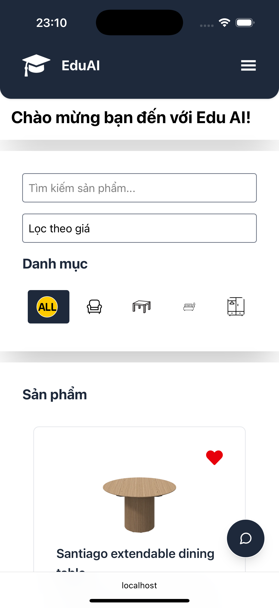
  </div>
  <div>
    <strong>Tablet</strong><br />
    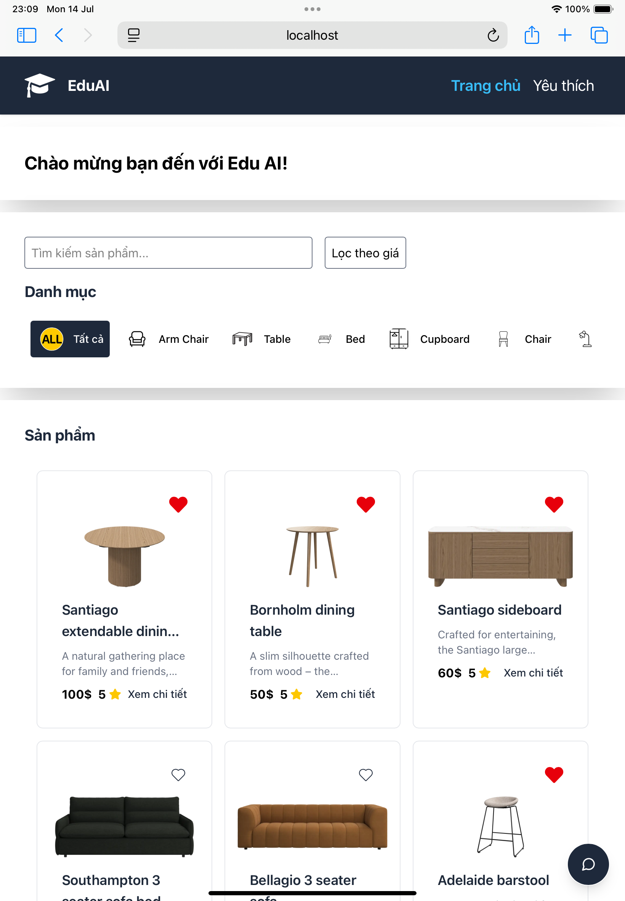
  </div>
  <div>
    <strong>PC</strong><br />
    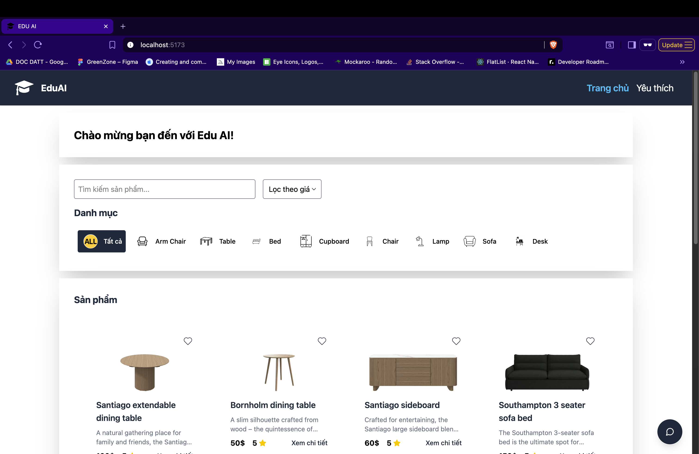
  </div>
</div>

---

### Favorites

  <div style="display: flex; justify-content: center; gap: 20px; text-align: center;">
    <div>
      <strong>Mobile</strong><br />
      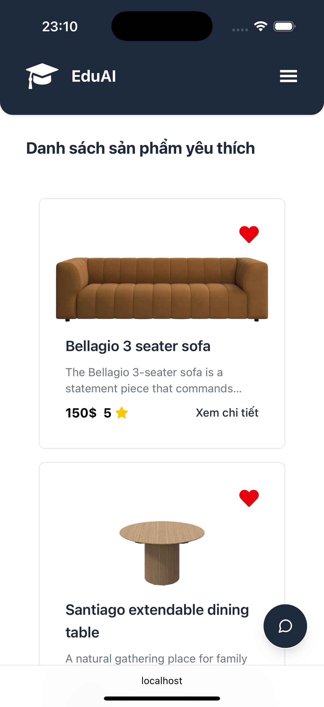
    </div>
    <div>
      <strong>Tablet</strong><br />
      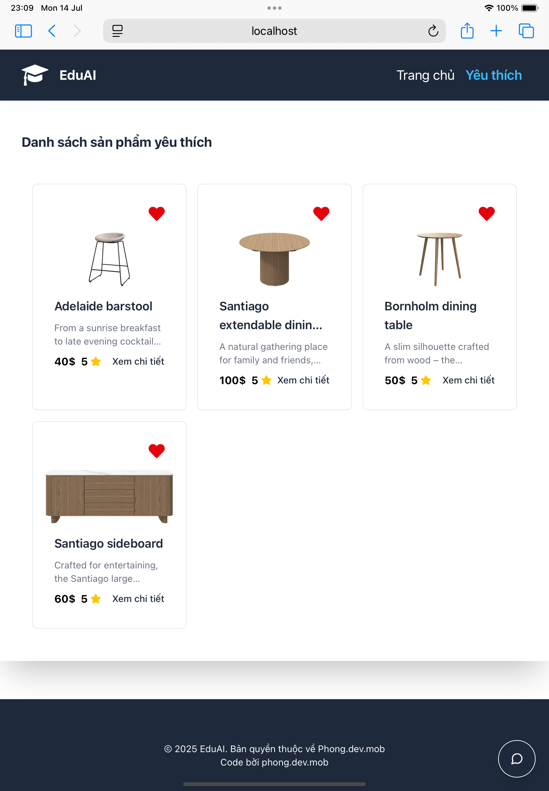
    </div>
    <div>
      <strong>PC</strong><br />
      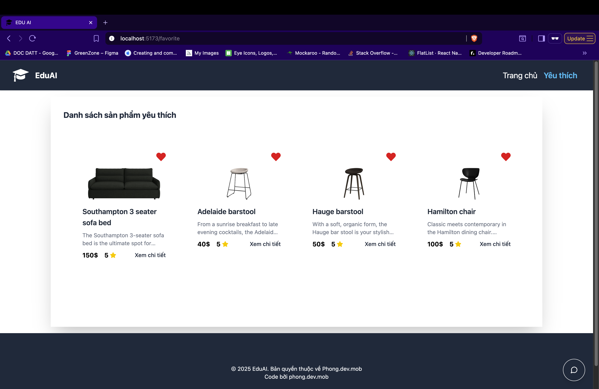
    </div>
  </div>

---

### Chatbox

  <div style="display: flex; justify-content: center; gap: 20px; text-align: center;">
    <div>
      <strong>Mobile</strong><br />
      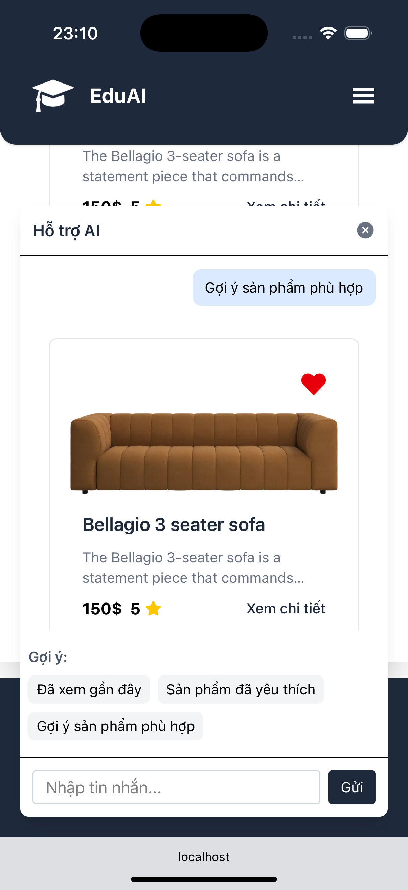
    </div>
    <div>
      <strong>Tablet</strong><br />
      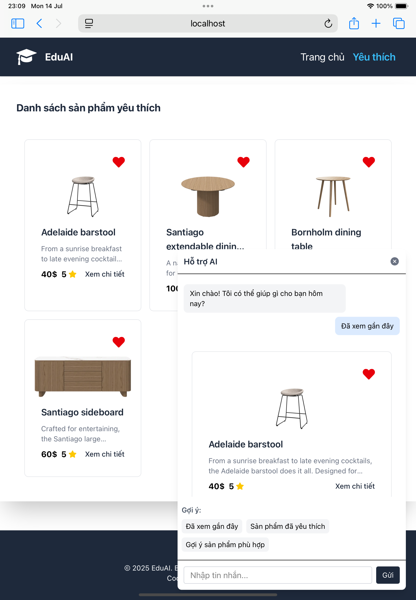
    </div>
    <div>
      <strong>PC</strong><br />
      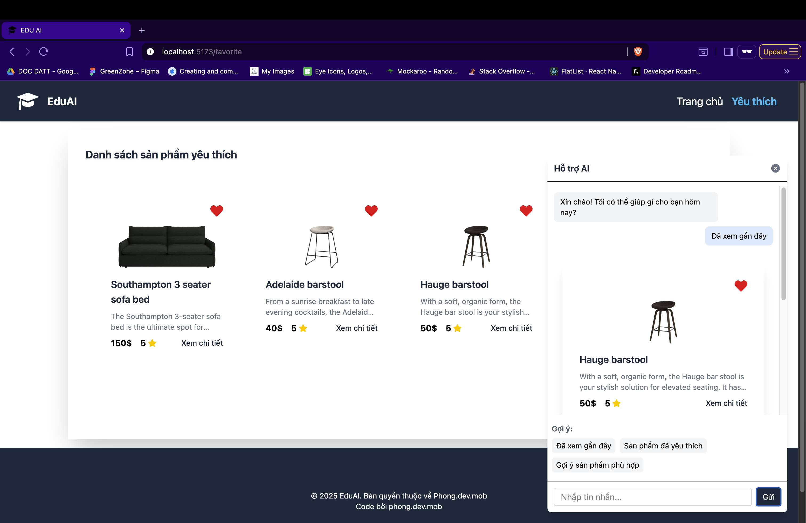
    </div>
  </div>

---

### Modal

  <div style="display: flex; justify-content: center; gap: 20px; text-align: center;">
    <div>
      <strong>Mobile</strong><br />
      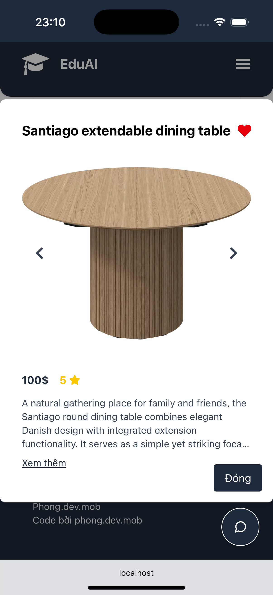
    </div>
    <div>
      <strong>Tablet</strong><br />
      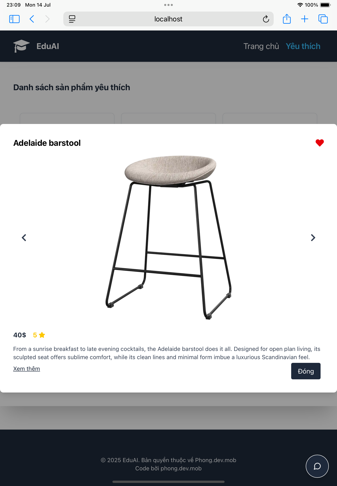
    </div>
    <div>
      <strong>PC</strong><br />
      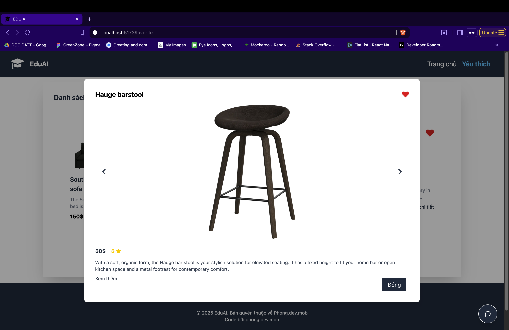
    </div>
  </div>

## Tác giả

Nguyễn Hồng Phong
Email: nguyenhongphong1010.02@gmail.com
